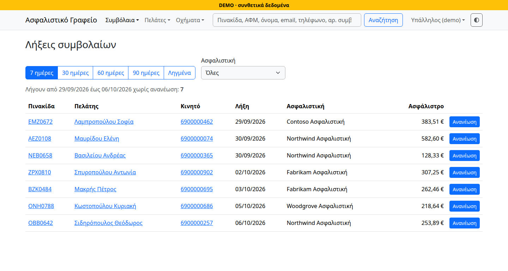
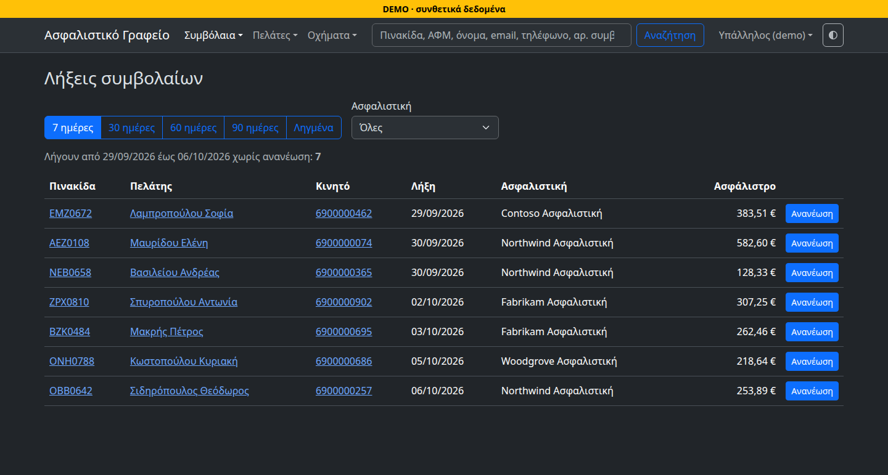
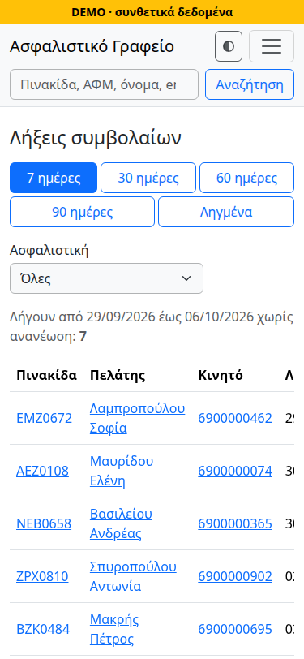
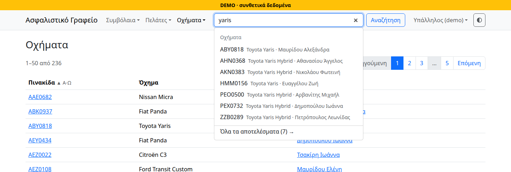
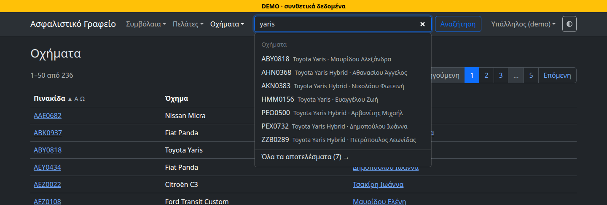
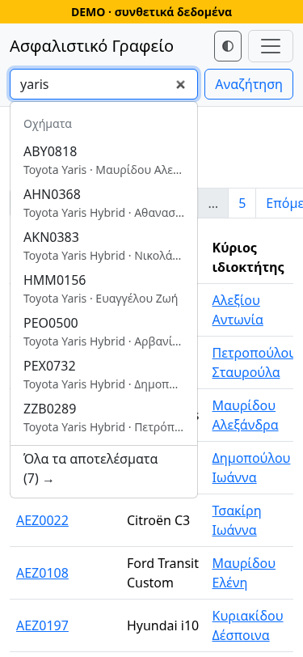
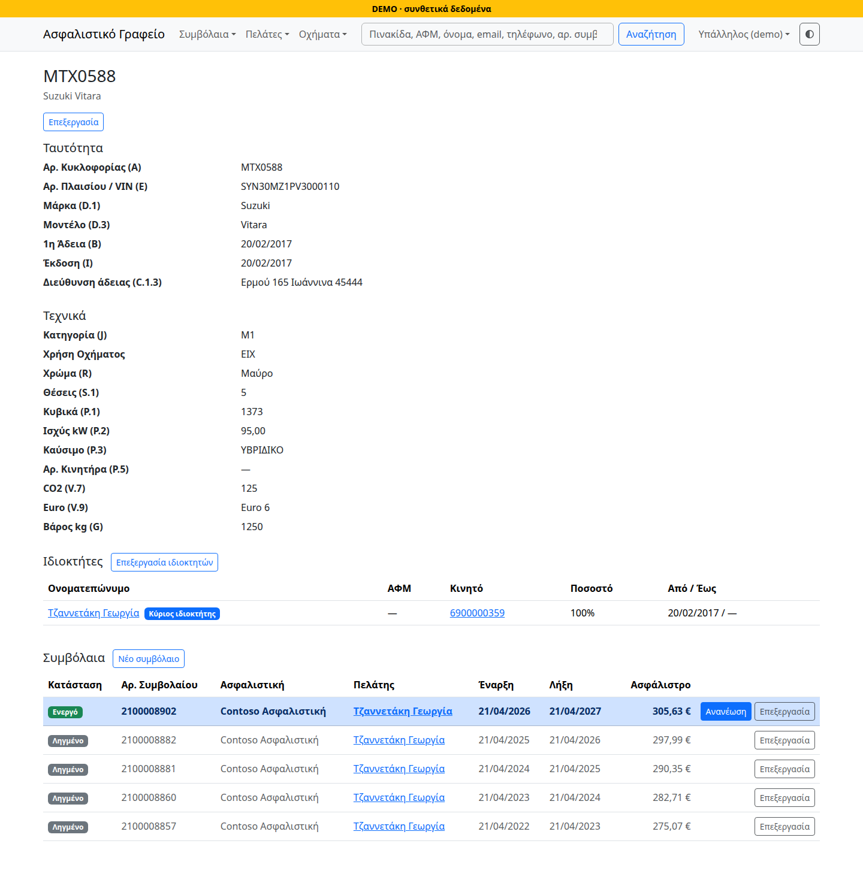
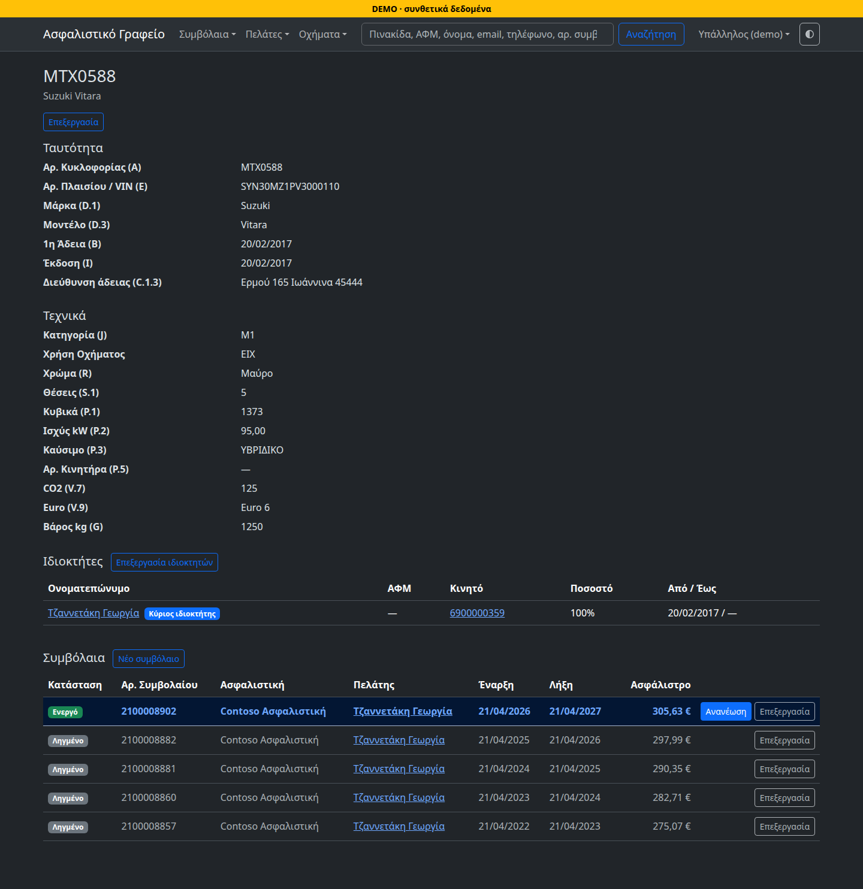
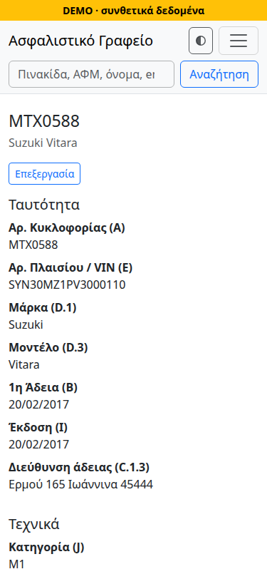

# Insurance office

A multi-user web application built to replace the Excel files of a small
Greek insurance office: customers, vehicles and who owns them, policies and their
renewals. Spring Boot and PostgreSQL, pages rendered on the server with
Thymeleaf. The interface is in Greek, because the office is.

> [!IMPORTANT]
> **All data in the screenshots and in the demo is synthetic.** It comes from
> a generator with a fixed seed
> ([`DemoData`](src/main/java/gr/insuranceoffice/demo/DemoData.java)): common
> Greek first names and surnames put together at random, tax numbers (ΑΦΜ)
> from the series `90000xxxx`, mobiles from `6900000xxx`, addresses at
> `example.com`, plates whose number starts with `0` (real ones run from
> 1000 to 9999), and insurers named after Microsoft's sample companies. None
> of it is a real customer, insurer or office. The repository is checked for
> personal data and secrets before every push, with
> [gitleaks](https://github.com/gitleaks/gitleaks) and rules of its own for
> ΑΦΜ, phones, plates and VINs ([`.gitleaks.toml`](.gitleaks.toml)).



## The problem

The office kept everything in Excel: one file of customers, one of vehicles
and their policies. Two jobs mattered most ([SPEC §1](docs/SPEC.md)):

- **Finding a record at the counter.** A customer walks in with a plate, a
  tax number, a phone number, a name or a policy number. The clerk must find
  them at once, in one box, without first choosing what kind of value was
  typed.
- **Not missing a renewal.** Car insurance runs for six or twelve months,
  and every policy about to end is a phone call to make before it lapses.

Two or three clerks work on the office network, and one person from
outside. The application is made to run on a small server in the office,
with Docker Compose ([`deploy/`](deploy/)), reached only through a VPN
(Tailscale).

## Screenshots

<table>
  <tr>
    <th>Light theme</th>
    <th>Dark theme</th>
    <th>Phone, 375px</th>
  </tr>
  <tr>
    <td colspan="3"><b>Home screen.</b> The policies ending in the chosen
    period, 7 days here, that have not been renewed yet, each with its
    «Ανανέωση» (renew) button.</td>
  </tr>
  <tr>
    <td><a href="docs/images/home-light.png"></a></td>
    <td><a href="docs/images/home-dark.png"></a></td>
    <td><a href="docs/images/home-phone.png"></a></td>
  </tr>
  <tr>
    <td colspan="3"><b>Search.</b> Suggestions while typing, here a model
    typed in lower case; customers and vehicles come in groups of their
    own.</td>
  </tr>
  <tr>
    <td><a href="docs/images/search-light.png"></a></td>
    <td><a href="docs/images/search-dark.png"></a></td>
    <td><a href="docs/images/search-phone.png"></a></td>
  </tr>
  <tr>
    <td colspan="3"><b>Vehicle card.</b> The licence's fields, the owners
    and every policy the vehicle had; this owner has no ΑΦΜ, which the
    application allows.</td>
  </tr>
  <tr>
    <td><a href="docs/images/vehicle-light.png"></a></td>
    <td><a href="docs/images/vehicle-dark.png"></a></td>
    <td><a href="docs/images/vehicle-phone.png"></a></td>
  </tr>
</table>

The screenshots are made from the demo's synthetic data by
[`ReadmeScreenshots`](src/browser-test/java/gr/insuranceoffice/browser/ReadmeScreenshots.java),
with Playwright, so they show the current pages; the pages and crops keep
tax and mobile numbers few. To make them again:
`./mvnw test -Pbrowser -Dtest=ReadmeScreenshots`.

## Run it

It needs Docker with Compose, and nothing else. In the folder of the
cloned repository:

```sh
docker compose -f compose.demo.yaml up
```

The first start builds the application from the sources (a few minutes),
starts PostgreSQL and the application, fills the empty database with the
synthetic data, and prints two accounts with random passwords:

```text
DEMO: συνθετικά δεδομένα (synthetic data): 200 πελάτες, 236 οχήματα, 647 συμβόλαια.
http://127.0.0.1:8080, με τους λογαριασμούς (accounts):
    ρόλος (role)  όνομα  κωδικός (password)
    ΔΙΑΧΕΙΡΙΣΤΗΣ  admin  <random>
    ΥΠΑΛΛΗΛΟΣ     clerk  <random>
```

Open <http://127.0.0.1:8080> and log in as `clerk`, or as `admin`, the
administrator, who can also delete. The passwords are printed only by the
start that made them. The data and the accounts stay from one `up` to the
next; to start over, with new data and new passwords:

```sh
docker compose -f compose.demo.yaml down -v
```

After pulling a newer version, `up --build` builds it. The demo listens on
this machine only, shows a yellow DEMO strip on every page, and fills no
database but its own: it checks the name before Flyway touches anything
([Task 39b](docs/TASKS.md#task-39b-το-profile-demo)).

For development, with JDK 21 and Docker: `./mvnw verify` builds and runs
every test on a real PostgreSQL, and `./mvnw verify -Pbrowser` adds the
browser tests (the first run downloads Chromium). The other commands are in
[`CLAUDE.md`](CLAUDE.md#commands).

## Technical highlights

Java 21, Spring Boot 4.1, Spring Data JPA with Hibernate 7, PostgreSQL 18
(`unaccent`, `pg_trgm`), Flyway, Thymeleaf and Bootstrap 5.3 with a little
plain JavaScript (no Node build), MapStruct, Apache POI for the one-off
Excel migration; JUnit, Testcontainers and Playwright for Java.

**One search box; accents, case and final sigma normalized twice, and a
test that keeps both sides equal.** Regular expressions decide what was
typed (VIN, plate, ΑΦΜ, mobile, landline, policy number), and anything else
is free text, where `Αλεξίου`, `αλεξιου` and `ΑΛΕΞΙΟΥ` are the same. The
stored side is a generated column that PostgreSQL computes, through an
`IMMUTABLE` wrapper of `unaccent` and upper-casing in the `pg_unicode_fast`
collation, so writes that bypass JPA (the Excel import, manual SQL) fill it
too; a trigram index serves it. The typed side is normalized in Java. An
integration test sends accented, mixed-case and final-sigma input through
both and requires the same output. Ten digits starting with `21` are both a
landline and a policy number, so both are searched and the results grouped.
Code: [`TextNormalizationUtils`](src/main/java/gr/insuranceoffice/util/TextNormalizationUtils.java),
[`V2__unaccent_wrapper.sql`](src/main/resources/db/migration/V2__unaccent_wrapper.sql),
[`SearchService`](src/main/java/gr/insuranceoffice/service/SearchService.java),
[`SearchNormalizationConsistencyTest`](src/test/java/gr/insuranceoffice/util/SearchNormalizationConsistencyTest.java).
Decision: [CLAUDE.md, resolved conflicts 1 and 3](CLAUDE.md#resolved-doc-conflicts);
[DECISIONS §3](docs/DECISIONS.md#3-ενιαίο-search-box-με-type-detection), one
box and no type dropdown.

**Greek plates.** A standard Greek plate uses only the 14 letters that
Greek and Latin share (Α Β Ε Ζ Η Ι Κ Μ Ν Ο Ρ Τ Υ Χ), and clerks type them
with either keyboard. A plate is stored in capitals and without dashes, in
the alphabet it was typed in, and a second column maps those 14 letters to
Latin, for search, sorting and the unique index: `ΑΒΕ-1234` and `ABE1234`
are one plate.
Greek-only letters stay Greek, so `ΑΒΓ-1234` is not `ABG-1234`: special
plates keep them.
Code: [`TextNormalizationUtils.normalizePlate`](src/main/java/gr/insuranceoffice/util/TextNormalizationUtils.java),
[`Vehicle`](src/main/java/gr/insuranceoffice/entity/Vehicle.java).
Decision: [CLAUDE.md, resolved conflict 5](CLAUDE.md#resolved-doc-conflicts).

**A unique violation is a message beside the field, not an error page.**
The services check uniqueness before writing, but two clerks can save the
same ΑΦΜ at the same moment, and then the database's unique index refuses
the second. The controller catches the exception outside the transaction,
which has already rolled back, and shows the form again with what was typed
and a Greek message beside the field. Which index is which field is read
from the constraint name in PostgreSQL's error (SQLState `23505`), never
from the message text, which changes with the server's language.
Code: [`UniqueConstraint`](src/main/java/gr/insuranceoffice/service/UniqueConstraint.java),
[`FormErrors`](src/main/java/gr/insuranceoffice/controller/FormErrors.java),
[`UniqueViolationFormTest`](src/test/java/gr/insuranceoffice/controller/UniqueViolationFormTest.java).
Decision: [Task 18](docs/TASKS.md#task-18-παραβίαση-μοναδικότητας-χωρίς-σφάλμα-500).

**Optimistic locking.** Customers, vehicles and policies carry a
`@Version`, and a form sends back the version it was opened with. A save
over someone else's change is refused: the form comes back with a message
and the clerk's input, and nothing is overwritten silently. Task 7 asked for
HTTP 409 from the JSON API of the time; the forms that replaced that API
show the conflict in the page. One detail: with a column the database
generates, Hibernate 7.4's `UPDATE … RETURNING` reported a stale version as
"no natively generated values", a 500, so a small dialect turns `RETURNING`
off, and a test fails without it.
Code: [`PostgreSQLVersionCheckingDialect`](src/main/java/gr/insuranceoffice/config/PostgreSQLVersionCheckingDialect.java),
[`OptimisticLockingTest`](src/test/java/gr/insuranceoffice/entity/OptimisticLockingTest.java).
Decision: [Task 7](docs/TASKS.md#task-7-optimistic-locking--advanced-validation);
[CLAUDE.md, resolved conflict 2](CLAUDE.md#resolved-doc-conflicts).

**An audit log from a JPA listener, in the same transaction.** Every
insert, update and delete of a customer, vehicle, ownership, policy or
intermediary is written to `audit_log` as JSONB, old and new values by
column, with the user's id, by an entity listener on the transaction's own
connection: a change and its log entry commit or roll back together.
Deletes are real deletes, and a deleted row can be put back from its JSON.
Hibernate Envers was rejected: its own tables per entity, and no JSONB.
Code: [`AuditListener`](src/main/java/gr/insuranceoffice/entity/AuditListener.java),
[`AuditListenerTest`](src/test/java/gr/insuranceoffice/entity/AuditListenerTest.java).
Decision: [ARCHITECTURE §6](docs/ARCHITECTURE.md#6-optimistic-locking-και-audit-logging).

**Tests on a real PostgreSQL, and in a real browser.** Every integration
test runs on PostgreSQL 18 in Testcontainers, never H2: generated columns,
`unaccent`, `pg_trgm` and the unique indexes are PostgreSQL's own. The
JavaScript (search suggestions, the guards on forms, owners' shares, the
date picker, the theme) is tested in headless Chromium with Playwright for
Java, in a Maven profile of its own, with no Node installed. Each part was
seen failing: 29 deliberate breakages of the JavaScript, one at a time, each
failed a test of its part but one, which is explained.
Code: [`TestcontainersConfiguration`](src/test/java/gr/insuranceoffice/TestcontainersConfiguration.java),
[`src/browser-test`](src/browser-test/java/gr/insuranceoffice/browser/).
Decision: [Task 24](docs/TASKS.md#task-24-έλεγχοι-browser-για-το-appjs);
[NOTES, browser tests](docs/NOTES.md#browser-tests-task-24).

**Passwords, and failed logins that reveal nothing.** One rule for every
password: 8 characters or more, a letter and a digit, spaces allowed, at
most 72 bytes because bcrypt reads no further, and never the username.
Accounts are made from the terminal, which asks for the password without
showing it, never on the command line. Five failed logins lock a username
for five minutes, counted per name as typed whether an account has it or
not: the page and the message are the same, and while a name is locked no
password is checked, so the answer takes the same time. The login page
never tells which accounts exist.
Code: [`PasswordPolicy`](src/main/java/gr/insuranceoffice/security/PasswordPolicy.java),
[`LoginAttempts`](src/main/java/gr/insuranceoffice/security/LoginAttempts.java),
[`LoginLockoutTest`](src/test/java/gr/insuranceoffice/security/LoginLockoutTest.java).
Decision: [Task 22](docs/TASKS.md#task-22-κωδικοί-και-σύνδεση).

## How it was built

I wrote the specification and made the decisions: what the office needs
([`SPEC`](docs/SPEC.md), [`DATA_MODEL`](docs/DATA_MODEL.md)), the plan as
numbered tasks with the decisions of each ([`TASKS`](docs/TASKS.md)), and
what was accepted or rejected ([`DECISIONS`](docs/DECISIONS.md)).

The code was written mostly by Claude Code, one task at a time, under the
rules of [`CLAUDE.md`](CLAUDE.md): only the task at hand, done only when the
whole test suite passes, and a question back to me whenever the documents
disagreed. Google Antigravity (`agy`) reviewed the work, for correctness
only ([`REVIEW-01`](docs/REVIEW-01.md) to [`REVIEW-10`](docs/REVIEW-10.md)); its
findings became tasks of their own, such as Task 18, or open items in
[`NOTES`](docs/NOTES.md).

The commit history shows the same order: a task's specification in a
`Docs:` commit, its implementation in an `Implement Task …` commit, and the
fixes a review asked for in `Address REVIEW-…` commits.

## Documentation

The documents in [`docs/`](docs/) are in Greek, apart from the reviews:
[`SPEC`](docs/SPEC.md) (requirements), [`DATA_MODEL`](docs/DATA_MODEL.md),
[`ARCHITECTURE`](docs/ARCHITECTURE.md), [`TASKS`](docs/TASKS.md) (the plan
and its decisions), [`DECISIONS`](docs/DECISIONS.md),
[`NOTES`](docs/NOTES.md) (open questions, known limits, measurements),
[`REVIEW-*`](docs/REVIEW-01.md) (in English) and
[`DEPLOYMENT`](docs/DEPLOYMENT.md). [`CLAUDE.md`](CLAUDE.md), in English,
holds the working rules and the decisions that override older wording.

## Licence

[MIT](LICENSE). All 161 third-party libraries, those of the tests and the
browser tests included, were checked once with license-maven-plugin 2.7.1
(`add-third-party`, not part of the build): Apache-2.0, MIT, BSD and EDL,
and EPL-2.0, LGPL-2.1 or GPL-2.0 with the Classpath Exception for libraries
used unmodified (Logback, JUnit, AspectJ, JNA, the Jakarta APIs), all
compatible with MIT; Bootstrap and flatpickr are MIT, Playwright is
Apache-2.0, and the Maven wrapper scripts keep their Apache-2.0 header.
